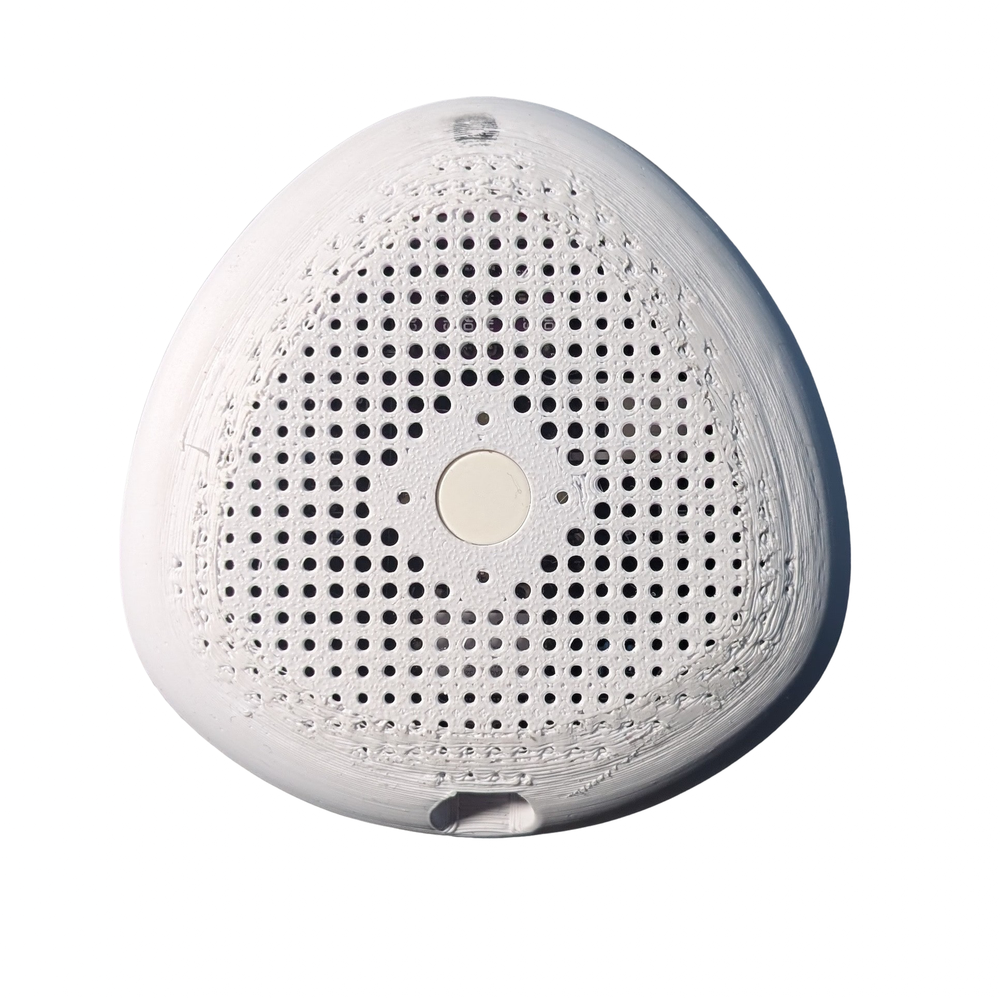

# Windy 💨  


<p align="center">
  
</p>

---

## 📝 Description

This folder contains everything you need to produce your own **Windy**, our smart air quality monitor.  
The project includes:

📱 A cross-platform companion app 

⚙️ The physical device with PCB and case  

📚 Full technical documentation doc pdf 


```md
Windy
├── firmware        
├── media        
├── PCB       
├── src        
└── doc   

```

### 🔥 Current capabilities 
📐 Measures CO2 and TVOC levels passively when connected to the phone

📊 Measures CO2 and TVOC on demand via the app or the device itself

📉 Provides a detailed history and trend of past measures

💡 Provides tips to improve air quality based on your situation


### ❤️‍🩹 Known Issues

Unfortunately, not all features we intended to implement function correctly.
We list here all known issues:
- The device collects data only while it is connected to the phone.
- The application experiences connection issues in everyday use, especially when the application is killed and the device is powered off and on in different combinations.

### ⭐️ Future work
We plan to insert a new card in the home describing the device status and 3D model, for those install the app without knowing about it.
  

## 📋 Table of Contents

- [Installation](#👨🏻‍💻_Installation)
- [Build the device](#👷🏻_Building_the_device)
- [Components](#Components_and_Links)
- [Case Printing](#🖨️_Case_Printing)
- [How to use](#🚀_How_to_use_it)
- [Authors](#authors)

## 👨🏻‍💻 Installation

 **Clone the repository**
   ```bash
   https://github.com/alexzilligmm/windy.git
   ```

   Go to the project folder and then to the application folder

   ```bash
   cd src
   ```

   Finally, execute:

   ```bash
   flutter run
   ```

   Make sure to have flutter installed as well as suitable platform for testing.
   Use the official page in case you need it [flutter](https://github.com/flutter).

## 👷🏻 Building the device
   
To build the prototype, we welded some commercial components onto a custom PCB board that we designed to enhance ease of assembly and overall elegance. **The PCB project files are included in the PCB folder.** To design the board, we used [KiCad](https://www.kicad.org). A custom 3D-printed shell protects the system, providing durability and aesthetic appeal. **We publish the STL file in the media folder.**

## 🔗 Components and Links:
We provide links to the components we bought for our prototypes.
1. **Microcontroller**: [ESP32](https://it.aliexpress.com/item/1005006979844970.html?src=google&pdp_npi=4%40dis%21EUR%210.33%210.15%21%21%21%21%21%40%2112000042939380583%21ppc%21%21%21&src=google&albch=shopping&acnt=272-267-0231&isdl=y&slnk=&plac=&mtctp=&albbt=Google_7_shopping&aff_platform=google&aff_short_key=UneMJZVf&gclsrc=aw.ds&&albagn=888888&&ds_e_adid=&ds_e_matchtype=&ds_e_device=c&ds_e_network=x&ds_e_product_group_id=&ds_e_product_id=it1005006979844970&ds_e_product_merchant_id=5363656664&ds_e_product_country=IT&ds_e_product_language=it&ds_e_product_channel=online&ds_e_product_store_id=&ds_url_v=2&albcp=20730495829&albag=&isSmbAutoCall=false&needSmbHouyi=false&gad_source=1&gbraid=0AAAAAoukdWOP5DAiLIRPO-Mvu6_XT2csv&gclid=Cj0KCQiAvbm7BhC5ARIsAFjwNHv4pMFK275LoFz30nNj27zO5X7SNDUG5R9QhFqye37QCixKh6vTkW8aAkNxEALw_wcB)
2. **Sensor**: [CJMCU-811](https://it.aliexpress.com/item/1005006201398375.html?spm=a2g0o.productlist.main.1.788d3a99VtUrea&algo_pvid=f1c9d5a9-a3ff-4240-9df6-4e7f97a3427b&algo_exp_id=f1c9d5a9-a3ff-4240-9df6-4e7f97a3427b-0&pdp_npi=4%40dis%21EUR%219.97%210.97%21%21%2110.14%210.99%21%40211b612817352886608636008e958f%2112000036247474053%21sea%21IT%210%21ABX&curPageLogUid=xZR8mRejGSyN&utparam-url=scene%3Asearch%7Cquery_from%3A)
3. **Battery**: [Lithium battery](https://it.aliexpress.com/item/1005007865793333.html?spm=a2g0o.productlist.main.5.56b97fc7NibO91&algo_pvid=f16a2610-2b83-417d-89df-a4212a11cf0d&algo_exp_id=f16a2610-2b83-417d-89df-a4212a11cf0d-2&pdp_npi=4%40dis%21EUR%213.10%210.97%21%21%2123.01%217.20%21%40211b65de17352886849121103eba80%2112000042603854421%21sea%21IT%210%21ABX&curPageLogUid=qTqaZXJFHmMW&utparam-url=scene%3Asearch%7Cquery_from%3A)

A detailed schema of assembly is provided in the report, including resistors details.

## 🖨️ Case Printing

The case has been designed by Daniel Maroni, a talented designer from Rome.

To build the physical enclosure for **Windy**, you can 3D print the case using the provided STL files.

[📽️ Watch the 3D printing process](media/case_3d_print.mp4)

You can find the STL files in the `media` folder:
- `case.stl`
- `case_3d_print.mp4` (video demonstration)

## 🚀 How to use it
Once the app is installed and the device ready, switch the device on using the switch on the side. Hold the main button to put the device on pairing mode. 

🛜 You should see it on the app now. Click to pair.

📏 It is now measuring the air quality! You can tune the frequency of the measurements in the settings.

📸 If you need a snapshot of the current air quality, press the main button again!

## Authors
Barreto Diego, Palmieri Simone, Piarulli Lorenzo, Marincione Davide, Zirilli Alessandro

designed by Daniel Maroni

Special thanks to Prof. Emanuele Panizzi for his helpful advice, especially in defining the future works.
